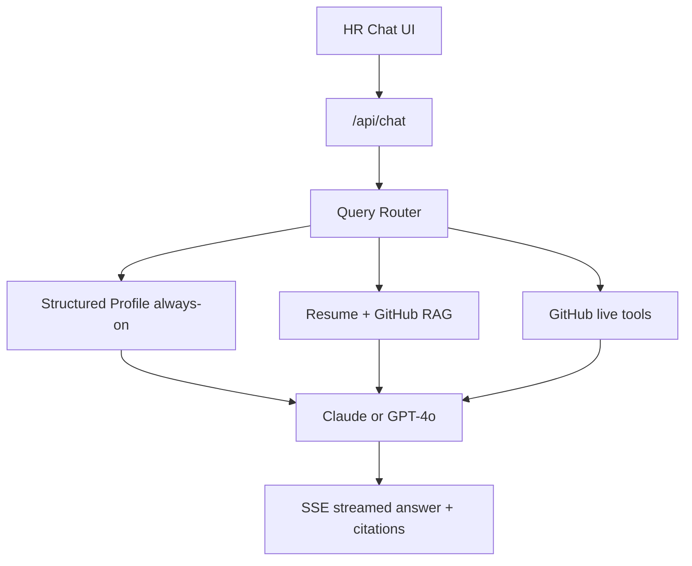
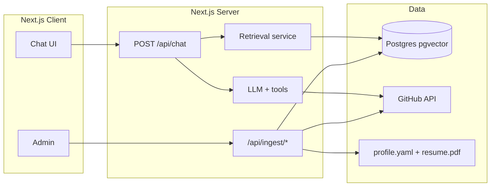

# Vita — Living Resume Chatbot

> Product plan for a personal, production-ready AI resume chatbot.
> Stack: Next.js + TypeScript + Anthropic/OpenAI + Postgres/pgvector.
> Scope: personal showcase (single candidate). Last synced from Cursor plan.

## Overview

Build **Vita** — a personal, production-ready AI resume chatbot that gives HRs a Claude-like chat interface backed by a structured profile, resume embeddings, and GitHub context so answers stay accurate and citation-backed.

## Product name

**Vita** (from *curriculum vitae*)

- Tagline: *Your living resume. Let recruiters ask.*
- Share URL shape: `vita.yourdomain.com` or `ask.yourname.dev`
- Why it works: short, professional, CV-rooted, brandable for a personal showcase without sounding like a generic “ResumeBot”

---

## Problem → product

HRs skim. Long emails and LinkedIn DMs get ignored. Vita replaces the wall of text with a **shareable chat link** where an HR can ask:

- “What’s their tech stack?”
- “Have they built production systems?”
- “Any relevant open-source / GitHub work?”
- “Years of experience with React?”

…and get **fast, grounded answers** from your curated professional context — not generic LLM fluff.

**Scope (locked):** personal showcase for you only (single candidate). Architecture stays clean enough to multi-tenant later, but we do **not** build SaaS signup, billing, or multi-user auth in v1.

---

## What context the agent gets (accuracy strategy)

Accuracy comes from **layered context**, not “dump everything into one prompt.”

### Layer 1 — Canonical Profile (always in system/context)

A hand-maintained, versioned source of truth (YAML/JSON), e.g. `content/profile.yaml`:

- Identity: name, title, location, links (portfolio, LinkedIn, GitHub, email)
- Experience: company, role, dates, 3–6 bullet achievements with metrics
- Skills: primary / secondary / tools (explicit years or “used in production” flags)
- Education, certifications
- Preferred narrative: 2–3 sentence “elevator pitch”
- Guardrails: topics to decline or redirect (salary expectations optional, personal life off-limits)

**Why:** Hard facts (dates, titles, stack) must not depend on RAG retrieval luck.

### Layer 2 — Resume PDF → embeddings (RAG)

- Upload/store your resume PDF under `content/resume.pdf` (or admin ingest)
- Parse → clean text → **semantic chunking** (by section: Experience, Projects, Skills; ~400–800 tokens, overlap ~80)
- Embed with OpenAI `text-embedding-3-small` (or compatible)
- Store in **Postgres + pgvector** (production-friendly, one DB, cheap for single-user)
- At query time: embed HR question → top-k chunks → inject as retrieved evidence

### Layer 3 — GitHub knowledge (ingest + optional live tools)

**Ingest (scheduled / on-demand):**

- GitHub API: pinned + selected repos (allowlist in config)
- Per repo: README, languages, topics, stars, last push, short description
- Optional: recent commit messages / contribution summary (rate-limit aware)
- Chunk + embed into the same vector store with `source: github`

**Live tools (agent can call when needed):**

- `list_repos`, `get_repo_readme`, `get_repo_languages` for fresh detail
- Never grant write scopes — **read-only** personal access token / GitHub App

### Layer 4 — LinkedIn (no scraping)

LinkedIn ToS forbids scraping. Production approach:

- Curate LinkedIn highlights into the Canonical Profile (headline, about, featured roles)
- Optionally store an exported LinkedIn PDF and embed it like the resume
- Always show a verified “View LinkedIn” link in the UI for HR trust
- Do **not** build automated LinkedIn search/scrape

### Answer policy (system prompt rules)

- Answer **only** from profile + retrieved chunks + tool results
- If unknown: say so and point to LinkedIn/GitHub/email — never invent employers or years
- Prefer concise recruiter-friendly answers (bullets, metrics, stack lists)
- Attach **citations** (`resume §Experience`, `github:repo-name`, `profile`) so HRs trust the bot
- Tone: confident, professional, first-person or third-person switchable (default: third-person about you)

---

## Tech stack (locked)

| Layer | Choice |
|-------|--------|
| App | **Next.js 15 (App Router) + TypeScript** |
| UI | Tailwind + shadcn/ui; Claude-like chat (streaming bubbles, markdown) |
| LLM | **Anthropic Claude** (primary) with OpenAI as optional fallback |
| Embeddings | OpenAI `text-embedding-3-small` |
| ORM | **Prisma** |
| Vector + app DB | **PostgreSQL + pgvector** (extension inside Postgres — not a separate product) |
| Dev DB | Local Postgres via Docker (pgvector image) |
| Prod DB | Any hosted Postgres with pgvector enabled (you choose later: Neon, Railway, self-host, etc.) |
| Auth | Public HR chat; **owner admin** via simple password / magic link (NextAuth or Clerk lite) |
| Ingest | Server actions / API routes + optional cron (Vercel cron) for GitHub re-sync |
| App hosting | Vercel (app) + your Postgres host (data) |
| Observability | Vercel Analytics + simple `chat_events` table (questions asked) |

---

## App surfaces

### 1. Public landing + chat (HR-facing)

- Hero: your name + one-line pitch + CTA “Ask about my experience”
- Claude-like chat: streaming responses, suggested starter questions, source chips
- Footer: resume PDF download, LinkedIn, GitHub, email
- Optional soft gate: share PIN / “company name” field (anti-spam, not heavy auth)

### 2. Owner admin (`/admin`)

- Edit / re-upload profile YAML + resume PDF
- Trigger GitHub sync
- View top HR questions (interview gold)
- Toggle maintenance / rate limits

---

## Core architecture

### Key modules (proposed repo layout)

- `app/(public)/page.tsx` — landing + chat
- `app/api/chat/route.ts` — streaming chat (SSE / AI SDK)
- `app/api/ingest/{resume,github,profile}/route.ts`
- `app/admin/...`
- `lib/profile.ts` — load canonical profile
- `lib/rag/{chunk,embed,retrieve}.ts`
- `lib/github/{sync,tools}.ts`
- `lib/llm/{system-prompt,agent}.ts`
- `content/profile.yaml`, `content/resume.pdf`
- `prisma/schema.prisma` — Prisma models: `chunks`, `conversations`, `messages`, `events` (+ pgvector via raw SQL / Prisma extension)

### Chat request flow

1. HR sends message (+ conversation id)
2. Persist user message
3. Retrieve top-k chunks (filter by source weights: profile facts already injected)
4. Build messages: system (policy + profile digest) + retrieved evidence + history (windowed)
5. Stream LLM; optionally tool-call GitHub if query is repo-specific
6. Persist assistant message + citations; log event for analytics

---

## Production readiness (v1 non-negotiables)

- Streaming UX + graceful error states
- Rate limit per IP / conversation (Upstash Redis or DB counters)
- Input length limits; no PII logging beyond chat content you own
- Environment secrets only via env (`ANTHROPIC_API_KEY`, `OPENAI_API_KEY`, `DATABASE_URL`, `GITHUB_TOKEN`)
- `.env.example` + README with setup
- Source citations in UI
- “I don’t know” path when retrieval confidence is low
- Basic E2E smoke: ingest → ask “tech stack” → grounded answer
- Deployable on Vercel in one push

**Explicitly out of v1:** multi-user SaaS, LinkedIn scraping, interview scheduling, email outreach automation, mobile native apps.

---

## Implementation phases

### Phase 0 — Foundation

- Scaffold Next.js + TS + Tailwind + shadcn
- Prisma + Postgres/pgvector schema (`chunks`, `conversations`, `messages`, `events`)
- Local Docker Postgres (pgvector) for development
- Env config, README, product branding for **Vita**

### Phase 1 — Context pipeline

- Profile YAML loader + types
- Resume PDF parse → chunk → embed → upsert
- GitHub allowlist sync → chunk → embed
- Admin ingest triggers + reindex

### Phase 2 — Chat agent

- System prompt + answer policy
- Retrieval + streaming chat API (Vercel AI SDK)
- Optional GitHub tools
- Citations in response metadata

### Phase 3 — HR UI

- Landing composition (brand-first: **Vita** / your name)
- Claude-like chat UI, starters, markdown, source chips
- Resume / LinkedIn / GitHub links

### Phase 4 — Harden & ship

- Rate limits, analytics of HR questions, admin polish
- Deploy Vercel + hosted Postgres (pgvector)
- Seed your real profile/resume/GitHub; QA with recruiter-style questions

---

## Implementation todos

| ID | Task | Status |
|----|------|--------|
| phase-0-foundation | Scaffold Next.js + TS + Tailwind/shadcn, Prisma + Postgres/pgvector schema, Docker Postgres, Vita branding, env/README | pending |
| phase-1-context | Build profile YAML + resume PDF + GitHub ingest → chunk/embed/upsert pipeline and admin reindex | pending |
| phase-2-agent | Implement retrieval, system policy, streaming chat API, optional GitHub tools, citations | pending |
| phase-3-ui | Ship HR landing + Claude-like chat UI with starters, markdown, source chips, profile links | pending |
| phase-4-ship | Add rate limits, HR-question analytics, deploy to Vercel + hosted Postgres, seed real data and QA | pending |

---

## Success criteria

- HR can open one link and get accurate answers on stack, experience, and projects in <3s time-to-first-token feel
- Zero fabricated employers/dates in spot-check QA
- Answers cite resume and/or GitHub when used
- You can re-ingest resume/GitHub without code changes
- Deployed public URL ready to paste into LinkedIn/email applications
